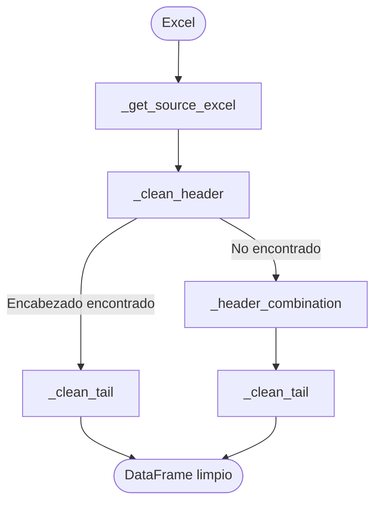

## Objetivo
El objetivo de la biblioteca es extraer y limpiar información en forma de tablas de archivos .xls y .xlsx
y regresarlos en formato limpio para la ingesta del pipeline ETL

## Casos que soporta
- Encabezado en fila 1
- Encabezado desplazado
- Encabezados de varias filas
- Columnas repetidas
- Filas completamente vacías
- Resúmenes al final
- Columnas sin nombre
- Columnas duplicadas
- Hojas con títulos

## Casos no soportados

- Dos tablas independientes en una misma hoja.
- Tablas horizontales.
- Encabezados completamente vacíos.
- Archivos protegidos.
- Archivos con imágenes incrustadas como datos.

## Flujo operativo

## Descripción de funciones

| Función             | Responsabilidad         |
| ------------------- | ----------------------- |
| _get_source_excel   | Leer Excel              |
| _find_header_row    | Buscar encabezado       |
| _clean_header       | Crear encabezado        |
| _header_combination | Reconstruir encabezados |
| _clean_tail         | Eliminar resúmenes      |
| excel_parser        | Interfaz pública        |
