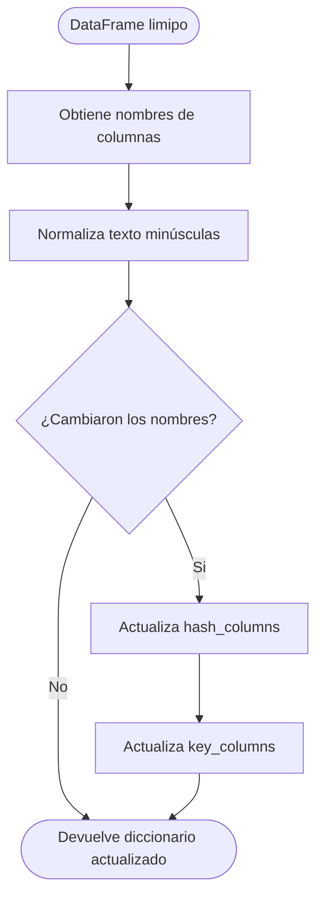
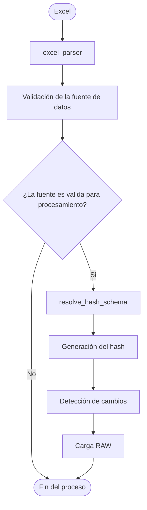

# Resolve Hash Schema

## Descripción
`resolve_hash_schema.py`es una biblioteca auxiliar del Pipele de Ingestión
encargada de adaptar el esquema de columnas utilizando oara construir el Hash 
de control.

Durante el proceso de extracción algunos archivos pueden modificar automáticamente
el nombre de las columnas. Esto ocurre principalmente cuando el `excel_parcer`
concatena encabezados de varias filas para conseervar la información original 
del archivo.

Ejemplo:

| Encabezado esperado | Encabezado obtenido |
|---------------------|---------------------|
| Material | Inventario>Material |
| Descripción | Empresa>Descripción |
| Descarga | Movimientos>Descarga |

---

## Objetivo

Resolver automáticamente diferencias entre:
- Columnas configuradas originalmente.
- Columnas reales obtenidas despues del parsing del archivo

Además actualiza automáticamente la columna identificadora utilizada por `key_columns`
si es que cambia de nombre.

---

## Fujo de trabajo

---

## Funciones
- `_normalize_text()` Normaliza una lista de textos
- `_find_column_name()`
  - Busca coinicidencias entre los nombres esperados y los encabezados reales del DataFrame.
  - Mediante una busqueda parcial.
  - Si las columnas son iguales devuelve None.
- `_replace_source_keys()`
  - Reemplaza cualquier llave del diccionario de configuración
- `_resolve_key_columns()`
  - Actualiza automáticamente la columna identificadora utilizada por key_columns
- `resolve_hash_schema()`
  - Función publica de la biblioteca:
  - Devuelve un nuevos diccionario.
    - Si no hubo cambios devuelve el mismo diccionario recibido
    - Si hubo modificaciones devuelve el diccionario actualizado

---

## Resposabilidad dentro del Pipeline

---

## Beneficios
- Evita modificar manualmente los diccionarios de configuración.
- Hace al pipeline resistente a cambios menores en los encabezados
- Conserva la estructura original del archivo
- Mantiene la lógica del Hash independiente del formato visual del excel
- Reduce el mantenimiento cuando cambian los nombres de las columnas
---

## Limitaciones
Actualmente la busqueda utiliza coinicdencias parciales de texto.
No corrige:
- Errores ortográficos
- Cambios completos de nombre
- Columnas eliminadas
- Dos columnas con el mismo texto base
